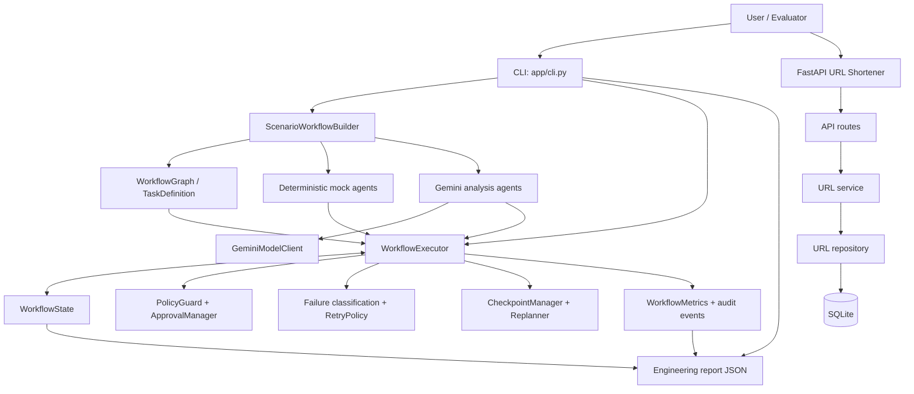
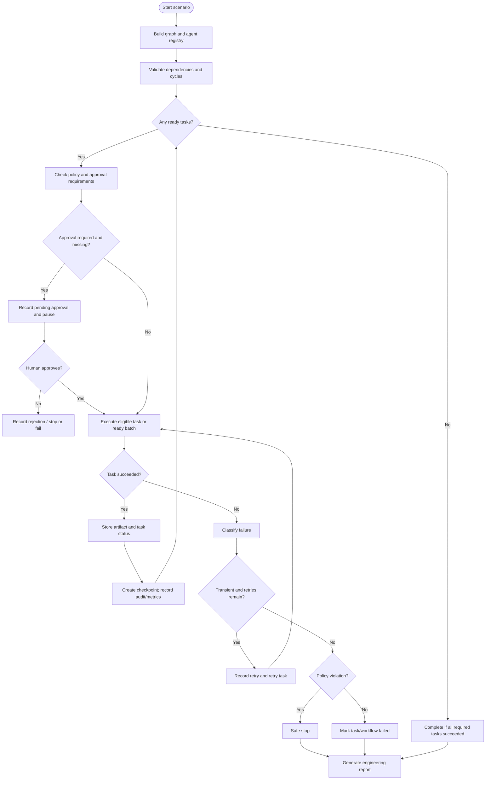
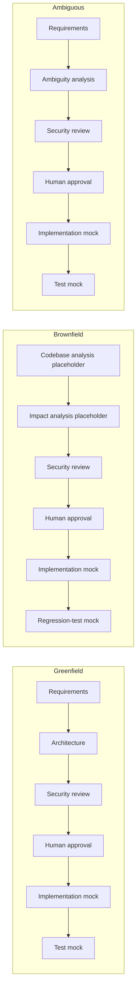

# Architecture Overview

## 1. Component diagram

## 2. Workflow control flow

## 3. Component responsibilities

| Component | Responsibility |
|---|---|
| `app/cli.py` | Parses scenario/provider options, runs the workflow, handles interactive approval, writes reports |
| `scenarios/workflow_builder.py` | Creates the scenario graph and selects mock or Gemini agents |
| `orchestrator/graph.py` | Defines tasks/dependencies and validates the graph |
| `orchestrator/executor.py` | Schedules eligible tasks, coordinates execution, updates state, handles retries and workflow transitions |
| `orchestrator/state.py` | Stores workflow status, context, artifacts, decisions, approvals, task status, retry counts, and audit events |
| `orchestrator/approval.py` | Records pending, approved, and rejected decisions |
| `orchestrator/policy.py` | Applies policy checks before high-impact operations |
| `orchestrator/retry.py`, `orchestrator/failure.py` | Define bounded retry policy and classify failures |
| `orchestrator/checkpoint.py` | Saves snapshots and restores selected workflow state during rollback |
| `orchestrator/replanner.py` | Invalidates affected downstream tasks when upstream work changes |
| `orchestrator/metrics.py` | Tracks workflow status, duration, retries, rollbacks, replans, and task failures |
| `orchestrator/report.py` | Builds an engineering summary from workflow state |
| `llm/gemini_client.py` | Calls Gemini and normalizes selected API errors |
| `agents/gemini_agents.py` | Uses Gemini for requirement, architecture, and design-level security analysis |
| `agents/mock_agents.py` | Provides deterministic stand-ins for agent stages |
| `app/api/routes.py`, `app/services/` | Expose and implement URL creation, redirects, analytics, and deletion |
| `app/repository/`, `app/db.py` | Persist URL data with SQLite and parameterized SQL |

## 4. Scenario dependency graphs

The current scenarios are mostly sequential chains:

The executor can schedule independent ready tasks concurrently if a graph contains parallel branches. The current three scenario definitions do not strongly demonstrate parallel branches; this is a known gap against the assignment's explicit parallel-path requirement.

## 5. Key design decisions

- **Separate orchestration from agent logic:** agents produce task outputs; the executor owns scheduling, approvals, policy, state transitions, retries, and auditability.
- **Keep mock mode available:** tests and demos can run without network access or LLM quota.
- **Make Gemini an interchangeable analysis provider:** the builder selects Gemini for requirements, architecture, and security analysis when configured.
- **Gate implementation behind human approval:** model-generated analysis cannot autonomously cross the high-impact implementation boundary.
- **Pass structured artifacts:** dictionary-shaped outputs allow downstream agents and reports to consume results.
- **Classify failures explicitly:** transient failures may be retried within bounds; policy failures should stop unsafe work.
- **Invalidate downstream work during replanning:** changed upstream outputs should not leave dependent artifacts marked current.

## 6. Current limitations

- Implementation and test agents are deterministic mocks; they do not generate code or run tests against generated changes.
- Brownfield analysis does not yet read repository files or produce a real impact map.
- The Gemini security agent performs a context-based design review, not a source-code security scan.
- The configured scenario graphs are mostly sequential; parallel execution capability exists in the executor but is not clearly demonstrated by the scenarios.
- Workflow metrics are local prototype measurements, not production telemetry or alerting.
- SQLite and local execution are demonstration choices, not a production deployment architecture.
